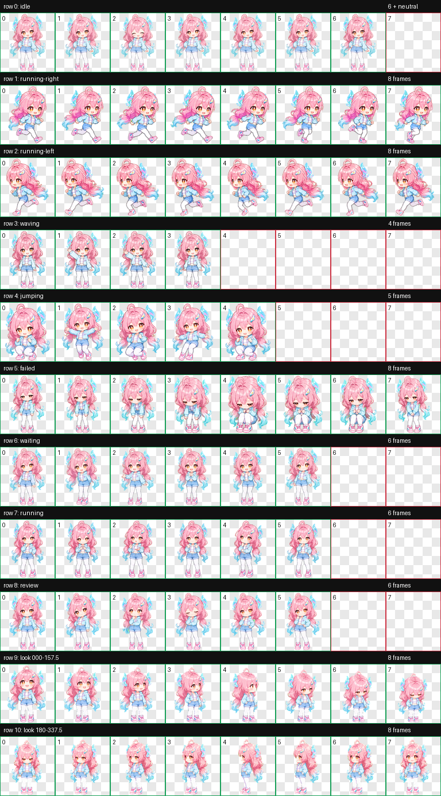

# Aemeath

Aemeath 是一个适用于 Codex Desktop 的 v2 动画宠物：一颗拥有粉蓝渐变长发、琥珀色眼睛和活力自拍气质的明亮星星。

> **原型声明：** 本 Pet 的角色原型基于《鸣潮》中的爱弥斯。《鸣潮》及爱弥斯的相关权益归其权利人所有。



## 特性

- Codex 宠物规范 v2（`spriteVersionNumber: 2`）
- 9 种标准动画状态：待机、向右移动、向左移动、挥手、跳跃、失败、等待、工作中和审查
- 16 个顺时针环视方向，覆盖 0°–337.5°
- 透明背景 RGBA WebP 图集
- 已通过确定性图集校验，无错误或警告

## 更新说明

### 2026-07-21

- 修复 row 0 `idle` 中人物长发跨越帧边界，导致相邻单元格出现边缘溢出碎片的问题。
- 重新生成并以组件方式提取完整的 6 帧待机动画；所有帧均为 `edge_pixels: 0`。
- 重新组装和验证完整 v2 图集，校验结果为 0 错误、0 警告。

## 安装

在项目目录中运行：

```bash
PET_DIR="${CODEX_HOME:-$HOME/.codex}/pets/aemeath"
mkdir -p "$PET_DIR"
cp pet.json spritesheet.webp "$PET_DIR/"
```

复制完成后，重新打开 Codex Desktop，让应用重新加载宠物资源。

安装后的目录应为：

```text
~/.codex/pets/aemeath/
├── pet.json
└── spritesheet.webp
```

## 文件说明

| 文件 | 用途 |
| --- | --- |
| `pet.json` | 宠物名称、描述、图集路径和规范版本 |
| `spritesheet.webp` | 可直接安装的 8×11 动画图集 |
| `contact-sheet.png` | 全部动画状态的联系表预览 |
| `look-directions.png` | 中立姿势与 16 个环视方向的专项预览 |
| `validation.json` | 最终图集的结构校验报告 |
| `installed-validation.json` | 已安装副本的校验报告 |
| `run-summary.json` | 生成、质检与安装产物摘要 |

## 图集规格

| 项目 | 值 |
| --- | --- |
| 规范版本 | v2 |
| 图集尺寸 | 1536×2288 px |
| 网格 | 8 列 × 11 行 |
| 单元格尺寸 | 192×208 px |
| 格式 | WebP（RGBA） |
| 已使用单元格 | 74 |
| 校验结果 | 通过，0 错误，0 警告 |

环视方向以屏幕坐标为准：0° 朝上、90° 朝右、180° 朝下、270° 朝左，其余姿势以 22.5° 为步长顺时针排列。

## 清单

宠物入口文件为 `pet.json`：

```json
{
  "id": "aemeath",
  "displayName": "Aemeath",
  "description": "A bright pink-and-cyan star sprite with flowing hair, radiant amber eyes, and cheerful selfie-star energy.",
  "spriteVersionNumber": 2,
  "spritesheetPath": "spritesheet.webp"
}
```

若要创建衍生版本，请保持 `pet.json` 中的 `id` 与安装目录名一致，并让 `spritesheetPath` 指向同目录下的图集文件。
